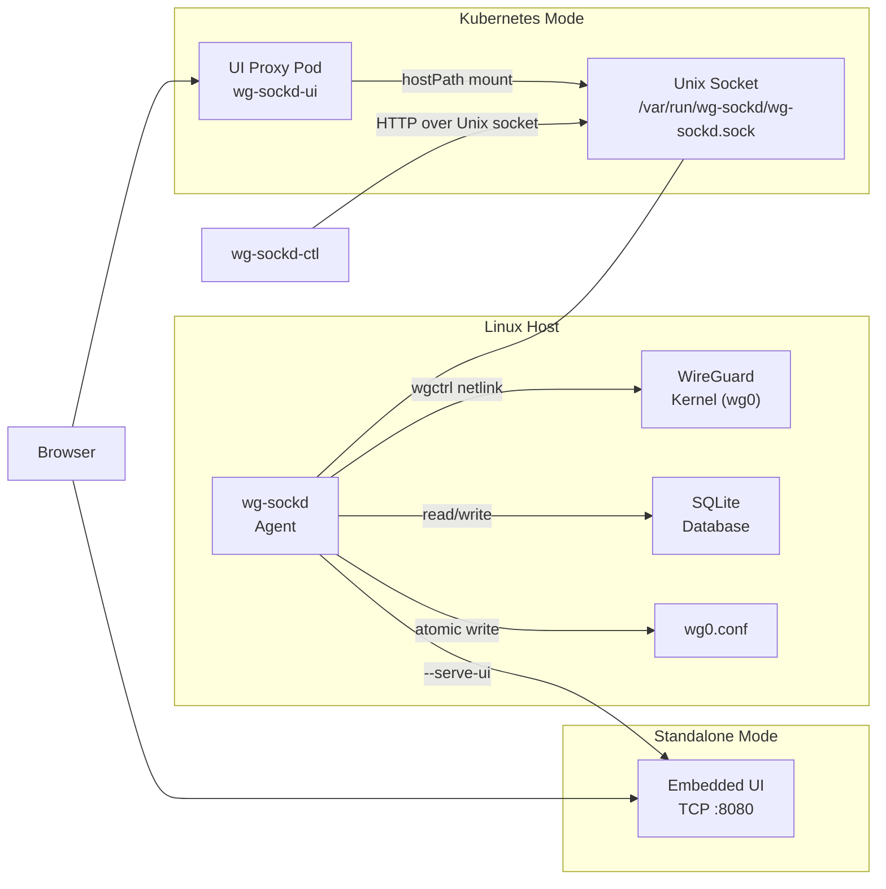

# wg-sockd

**WireGuard peer management agent** — manage VPN peers through a REST API, web UI, or CLI. Profile-based access control, auto-discovery of unknown peers, QR codes, and one-command deployment.

[](https://go.dev)
[](LICENSE)

---

## Features

- **Profile-based peers** — define network access templates (full-tunnel, split-tunnel, NAS-only) with CIDR exclusion
- **Auto-discovery** — unknown peers added via `wg set` are detected, blocked, and recorded for review
- **QR codes** — scan peer config from your phone
- **Web UI** — responsive React SPA for peer management, stats dashboard, and profile configuration
- **CLI** — `wg-sockd-ctl` for scripting and headless management
- **Reconciliation** — kernel ↔ database sync every 30s ensures consistency
- **Key rotation** — instant keypair swap for compromised keys
- **Standalone or K8s** — embedded UI mode for NAS/single-host, Helm chart for Kubernetes

## Architecture



## Quick Start — Standalone

The fastest way to get started. One command installs the agent with embedded web UI.

### 1. Install

```bash
curl -sSL https://raw.githubusercontent.com/aleks-dolotin/wg-sockd/main/deploy/install.sh | sudo bash
```

This creates the `wg-sockd` user (GID 5000), installs the binary, sets up systemd, and starts the service.

### 2. Enable Web UI

```bash
# Option A: Serve UI from pre-built static files
sudo systemctl stop wg-sockd
sudo wg-sockd --config /etc/wg-sockd/config.yaml --serve-ui-dir /opt/wg-sockd/ui/dist

# Option B: Use embedded UI binary (if built with make build-full)
sudo wg-sockd --config /etc/wg-sockd/config.yaml --serve-ui
```

### 3. Open Browser

```
http://your-host:8080
```

### 4. Create Your First Peer

```bash
# Via CLI:
wg-sockd-ctl peers add --name "alice-phone" --profile "full-tunnel"

# Via API:
curl --unix-socket /var/run/wg-sockd/wg-sockd.sock \
  -X POST http://localhost/api/peers \
  -H "Content-Type: application/json" \
  -d '{"friendly_name": "alice-phone", "profile": "full-tunnel"}'
```

### 5. Scan QR Code

```bash
# Open in browser:
http://your-host:8080/peers

# Or via API — save QR as PNG:
curl --unix-socket /var/run/wg-sockd/wg-sockd.sock \
  http://localhost/api/peers/1/qr -o peer-qr.png
```

---

## Quick Start — Kubernetes

For K8s deployments, the agent runs on the host and a lightweight UI proxy pod connects via hostPath.

### Prerequisites

- WireGuard running on the target node
- Agent installed on the node (via `install.sh`)
- Node labeled: `kubectl label node <node> wg-sockd=active`

### Install UI via Helm

```bash
helm install wg-sockd-ui ./chart/ \
  --set image.repository=ghcr.io/aleks-dolotin/wg-sockd-ui \
  --set image.tag=latest
```

### Verify

```bash
kubectl port-forward svc/wg-sockd-ui 8080:8080
open http://localhost:8080
```

### Custom Values

```yaml
# values.yaml
image:
  repository: ghcr.io/aleks-dolotin/wg-sockd-ui
  tag: "0.1.0"

# Pin to specific node (alternative to nodeSelector)
nodeName: my-wg-node

# Security — must match host GID
securityContext:
  runAsGroup: 5000
podSecurityContext:
  supplementalGroups:
    - 5000
```

---

## Configuration

Config file: `/etc/wg-sockd/config.yaml`

```yaml
# WireGuard interface name
interface: wg0

# Unix socket path (agent listens here)
socket_path: /var/run/wg-sockd/wg-sockd.sock

# SQLite database path
db_path: /var/lib/wg-sockd/wg-sockd.db

# WireGuard config file (agent manages [Peer] sections)
conf_path: /etc/wireguard/wg0.conf

# Auto-approve unknown peers (WARNING: disables security blocking)
auto_approve_unknown: false

# Maximum number of peers
peer_limit: 250

# Reconciliation interval
reconcile_interval: 30s

# External endpoint for client configs (e.g., "vpn.example.com:51820")
# external_endpoint: "vpn.example.com:51820"

# Peer profiles — seeded on first start, then managed via API
# peer_profiles:
#   - name: full-tunnel
#     display_name: "Full Tunnel"
#     allowed_ips: ["0.0.0.0/0", "::/0"]
#     description: "Route all traffic through VPN"
#   - name: nas-only
#     display_name: "NAS Only"
#     allowed_ips: ["192.168.1.0/24"]
#     exclude_ips: ["192.168.1.1/32"]
#     description: "Access NAS network only"
```

All config fields can be overridden via CLI flags:

```
--interface wg0           WireGuard interface name
--socket-path PATH        Unix socket path
--db-path PATH            SQLite database path
--conf-path PATH          WireGuard config file path
--listen-addr ADDR        HTTP listen address
--auto-approve-unknown    Auto-approve unknown peers
--serve-ui                Serve embedded UI on TCP
--serve-ui-dir PATH       Serve UI from external directory
--ui-listen ADDR          TCP listen address for UI (default :8080)
```

---

## API Reference

All endpoints are available via Unix socket. Use `curl --unix-socket` for direct access.

### Health

```bash
# GET /api/health
curl --unix-socket /var/run/wg-sockd/wg-sockd.sock http://localhost/api/health
# {"status":"ok","wireguard":"ok","sqlite":"ok"}
```

### Stats

```bash
# GET /api/stats
curl --unix-socket /var/run/wg-sockd/wg-sockd.sock http://localhost/api/stats
# {"total_peers":5,"online_peers":2,"total_rx":1048576,"total_tx":524288}
```

### Peers

```bash
# GET /api/peers — list all peers
curl --unix-socket /var/run/wg-sockd/wg-sockd.sock http://localhost/api/peers

# POST /api/peers — create peer (with profile)
curl --unix-socket /var/run/wg-sockd/wg-sockd.sock \
  -X POST http://localhost/api/peers \
  -H "Content-Type: application/json" \
  -d '{"friendly_name": "bob-laptop", "profile": "full-tunnel"}'

# POST /api/peers — create peer (with custom IPs)
curl --unix-socket /var/run/wg-sockd/wg-sockd.sock \
  -X POST http://localhost/api/peers \
  -H "Content-Type: application/json" \
  -d '{"friendly_name": "custom-peer", "allowed_ips": ["10.0.0.0/24"]}'

# PUT /api/peers/{id} — update peer
curl --unix-socket /var/run/wg-sockd/wg-sockd.sock \
  -X PUT http://localhost/api/peers/1 \
  -H "Content-Type: application/json" \
  -d '{"friendly_name": "bob-laptop-new", "notes": "Updated name"}'

# DELETE /api/peers/{id} — delete peer
curl --unix-socket /var/run/wg-sockd/wg-sockd.sock \
  -X DELETE http://localhost/api/peers/1

# GET /api/peers/{id}/conf — download client .conf
curl --unix-socket /var/run/wg-sockd/wg-sockd.sock \
  http://localhost/api/peers/1/conf

# GET /api/peers/{id}/qr — download QR code PNG
curl --unix-socket /var/run/wg-sockd/wg-sockd.sock \
  http://localhost/api/peers/1/qr -o peer.png

# POST /api/peers/{id}/rotate-keys — rotate keypair
curl --unix-socket /var/run/wg-sockd/wg-sockd.sock \
  -X POST http://localhost/api/peers/1/rotate-keys

# POST /api/peers/{id}/approve — approve auto-discovered peer
curl --unix-socket /var/run/wg-sockd/wg-sockd.sock \
  -X POST http://localhost/api/peers/5/approve

# POST /api/peers/batch — create multiple peers
curl --unix-socket /var/run/wg-sockd/wg-sockd.sock \
  -X POST http://localhost/api/peers/batch \
  -H "Content-Type: application/json" \
  -d '{"peers": [{"friendly_name": "peer1", "profile": "nas-only"}, {"friendly_name": "peer2", "profile": "nas-only"}]}'
```

### Profiles

```bash
# GET /api/profiles — list all profiles
curl --unix-socket /var/run/wg-sockd/wg-sockd.sock http://localhost/api/profiles

# POST /api/profiles — create profile
curl --unix-socket /var/run/wg-sockd/wg-sockd.sock \
  -X POST http://localhost/api/profiles \
  -H "Content-Type: application/json" \
  -d '{"name": "media-only", "display_name": "Media Server", "allowed_ips": ["192.168.1.0/24"], "exclude_ips": ["192.168.1.1/32"], "description": "Access media server only"}'

# PUT /api/profiles/{name} — update profile
curl --unix-socket /var/run/wg-sockd/wg-sockd.sock \
  -X PUT http://localhost/api/profiles/media-only \
  -H "Content-Type: application/json" \
  -d '{"description": "Updated description"}'

# DELETE /api/profiles/{name} — delete profile (fails if peers use it)
curl --unix-socket /var/run/wg-sockd/wg-sockd.sock \
  -X DELETE http://localhost/api/profiles/media-only
```

---

## Profiles

Profiles define reusable network access templates. Each profile has:

- **allowed_ips** — CIDRs the peer can reach
- **exclude_ips** — CIDRs subtracted from allowed_ips (e.g., exclude gateway)
- **resolved_allowed_ips** — computed result after exclusion

Example profiles:

| Name | Allowed IPs | Exclude IPs | Result |
|------|-------------|-------------|--------|
| full-tunnel | `0.0.0.0/0`, `::/0` | — | All traffic through VPN |
| nas-only | `192.168.1.0/24` | `192.168.1.1/32` | LAN except gateway |
| split-tunnel | `0.0.0.0/0` | `192.168.0.0/16`, `10.0.0.0/8` | Internet only, not local |

Profiles are seeded from `config.yaml` on first start. After that, the database is the source of truth — manage via API or UI.

---

## CLI Reference

`wg-sockd-ctl` is a standalone CLI for the agent API.

```bash
# List peers
wg-sockd-ctl peers list

# Add peer with profile
wg-sockd-ctl peers add --name "alice-phone" --profile "full-tunnel"

# Add peer with custom IPs
wg-sockd-ctl peers add --name "custom" --allowed-ips "10.0.0.0/24,192.168.1.0/24"

# Delete peer (with confirmation)
wg-sockd-ctl peers delete --id 3

# Delete peer (skip confirmation)
wg-sockd-ctl peers delete --id 3 --yes

# Approve auto-discovered peer (by pubkey prefix)
wg-sockd-ctl peers approve abc123

# List profiles
wg-sockd-ctl profiles list

# Use custom socket path
wg-sockd-ctl --socket /custom/path.sock peers list
```

---

## Security

### Socket Permissions

The agent listens on a Unix domain socket with restricted permissions:

- Socket created with `umask(0117)` → permissions `0660`
- Only `wg-sockd` group members can connect
- No TCP exposure by default — zero network attack surface

### Capabilities

- Agent runs as `wg-sockd` user (not root)
- Only `CAP_NET_ADMIN` capability for WireGuard kernel operations
- `ProtectSystem=strict`, `NoNewPrivileges=yes` in systemd

### Unknown Peer Blocking (F3)

- Peers found in WireGuard kernel but not in database are **immediately removed**
- Removed peers are recorded in SQLite with `auto_discovered: true`, `enabled: false`
- Admin must explicitly approve via UI or `wg-sockd-ctl peers approve`
- Override: `auto_approve_unknown: true` in config (development only, logged as WARNING)

### Key Handling (RT-3)

- Private keys are **never stored** in the database
- Private keys appear only in the create response and QR code
- Key rotation generates new keypair and invalidates the old one atomically

### Rate Limiting (RT-2)

- In-memory per-connection token bucket: **10 req/s** default (configurable via `rate_limit` in config.yaml)
- Exceeding limit returns HTTP 429 with `Retry-After: 1` header
- Health endpoint (`/api/health`) is always exempted — monitoring and watchdog never throttled
- Set `rate_limit: 0` to disable

### Operational Resilience

- **Socket self-healing (FM-3)** — agent monitors socket file every 5s; if deleted or replaced, automatically re-creates listener and resumes serving
- **Debounced conf writing (PM-4)** — rapid mutations are coalesced into a single `wg0.conf` write (100ms window); batch endpoint bypasses debounce
- **Graceful degradation (FM-6)** — when disk is full, write operations return HTTP 503 while reads continue working; auto-recovers when space is freed
- **SQLite backup & recovery (FM-2)** — hourly `.db.bak` with fsync; 3-level recovery chain on corruption: backup → conf comments → clean start

### Config Preservation (F4)

- Agent **never modifies** the `[Interface]` section of `wg0.conf`
- Only `[Peer]` sections are managed, with `# wg-sockd:` metadata comments
- PostUp/PostDown, MTU, DNS, and other Interface settings are preserved

---

## Building

```bash
# Build lean agent (~15MB)
make build

# Build agent with embedded UI (~30MB)
make build-full

# Build CLI
make build-ctl

# Run all tests
make test-all

# Build UI Docker image
make docker-build
```

---

## License

MIT

