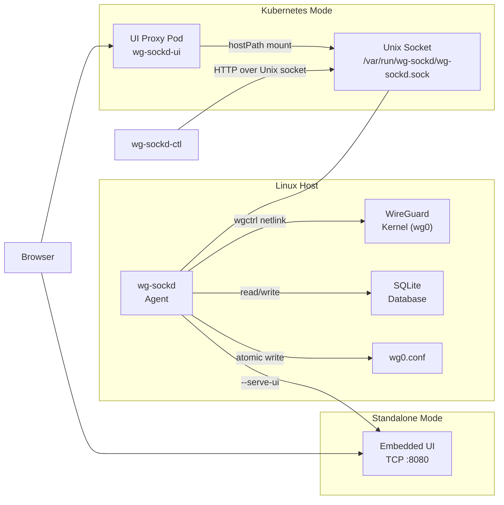

# wg-sockd

**WireGuard peer management agent** — manage VPN peers through a REST API, web UI, or CLI. Profile-based access control, auto-discovery of unknown peers, QR codes, and one-command deployment.

[](https://go.dev)
[](LICENSE)

---

## Features

- **Profile-based peers** — define network access templates (full-tunnel, split-tunnel, NAS-only) with CIDR exclusion
- **Auto-discovery** — unknown peers added via `wg set` are detected, blocked, and recorded for review
- **QR codes** — scan peer config from your phone
- **Web UI** — responsive React SPA for peer management, stats dashboard, and profile configuration
- **CLI** — `wg-sockd-ctl` for scripting and headless management
- **Reconciliation** — kernel ↔ database sync every 30s ensures consistency
- **Key rotation** — instant keypair swap for compromised keys
- **Standalone or K8s** — embedded UI mode for NAS/single-host, Helm chart for Kubernetes

## Architecture



## Quick Start — Standalone

The fastest way to get started. One command installs the agent with embedded web UI.

### Prerequisites

- **Linux** — amd64 or arm64
- **WireGuard** — `wg` and `wg-quick` must be in PATH. Install with:
  - Ubuntu/Debian: `apt install wireguard-tools`
  - Fedora: `dnf install wireguard-tools`
  - Arch: `pacman -S wireguard-tools`
  - Alpine: `apk add wireguard-tools`
- **WireGuard interface** — a running `wg0` interface with `[Interface]` section configured in `/etc/wireguard/wg0.conf`
- **WireGuard directory permissions** — the agent runs as user `wg-sockd` and needs read/write access to `/etc/wireguard/`. WireGuard defaults to `700 root:root`. The install script sets correct permissions automatically. If installing manually, see [WireGuard Directory Permissions](docs/deployment-guide.md#wireguard-directory-permissions).

### 1. Install

```bash
curl -sSL https://raw.githubusercontent.com/aleks-dolotin/wg-sockd/main/deploy/install.sh | sudo bash
```

This creates the `wg-sockd` user (GID 5000), installs the full binary (with embedded UI) + CTL, sets up systemd, and starts the service. The installer will prompt for UI binding address interactively or default to `0.0.0.0:8080` when piped.

To install without starting the service automatically:

```bash
curl -sSL https://raw.githubusercontent.com/aleks-dolotin/wg-sockd/main/deploy/install.sh | sudo bash -s -- --no-start
```

Then start when ready:

```bash
sudo systemctl enable --now wg-sockd
```

### 2. Open Browser

```
http://your-host:8080
```

The UI is configured via `serve_ui` and `ui_listen` in `/etc/wg-sockd/config.yaml`.

### 3. Verify Installation

Check version of both binaries:

```bash
wg-sockd --version
wg-sockd-ctl --version
```

Validate config and prerequisites:

```bash
sudo wg-sockd --config /etc/wg-sockd/config.yaml --dry-run
```

### 4. Create Your First Peer

Via CLI:

```bash
wg-sockd-ctl peers add --name "alice-phone" --profile "full-tunnel"
```

Via API:

```bash
sudo curl --unix-socket /var/run/wg-sockd/wg-sockd.sock \
  -X POST http://localhost/api/peers \
  -H "Content-Type: application/json" \
  -d '{"friendly_name": "alice-phone", "profile": "full-tunnel"}'
```

### 5. Scan QR Code

Open in browser: `http://your-host:8080/peers`

Click on a peer to open the detail page — QR code is shown in the Create Peer and Rotate Keys dialogs.

---

## Quick Start — Kubernetes

For K8s deployments, the agent runs on the host (headless, no UI) and a separate UI proxy pod connects via hostPath.

### Prerequisites

- WireGuard running on the target node
- Node labeled for pod scheduling (see below)

### 1. Label the Node

The UI proxy pod uses `nodeSelector` to land on the node where the agent's Unix socket lives. First, find your node name:

```bash
kubectl get nodes
```

Then label the node where WireGuard is running:

```bash
kubectl label node MY_NODE_NAME wg-sockd=active
```

Replace `MY_NODE_NAME` with the actual name from the output above.

Verify the label was applied:

```bash
kubectl get nodes --show-labels | grep wg-sockd
```

### 2. Install Agent on Node

SSH into the node and run the installer:

```bash
curl -sSL https://raw.githubusercontent.com/aleks-dolotin/wg-sockd/main/deploy/install.sh | sudo bash -s -- --agent-only
```

To install without starting the service automatically, combine both flags:

```bash
curl -sSL https://raw.githubusercontent.com/aleks-dolotin/wg-sockd/main/deploy/install.sh | sudo bash -s -- --agent-only --no-start
```

### 3. Install UI via Helm

Install or upgrade the chart directly from the registry — no need to clone the repository:

```bash
helm upgrade --install wg-sockd-ui oci://ghcr.io/aleks-dolotin/charts/wg-sockd-ui \
  --version 0.21.0 -n wg-sockd --create-namespace
```

This creates a `wg-sockd` namespace and deploys the UI proxy pod there.

### 4. Verify

```bash
kubectl port-forward -n wg-sockd svc/wg-sockd-ui 8080:8080
```

Then open `http://localhost:8080`.

### Custom Values

```yaml
image:
  repository: ghcr.io/aleks-dolotin/wg-sockd-ui
  tag: "0.21.0"

nodeName: my-wg-node

securityContext:
  runAsGroup: 5000
podSecurityContext:
  supplementalGroups:
    - 5000
```

`nodeName` pins the pod to a specific node (alternative to `nodeSelector`). The `runAsGroup` and `supplementalGroups` must match the host GID (5000).

---

## Configuration

Config file: `/etc/wg-sockd/config.yaml`

```yaml
# WireGuard interface name
interface: wg0

# Unix socket path (agent listens here)
socket_path: /var/run/wg-sockd/wg-sockd.sock

# SQLite database path
db_path: /var/lib/wg-sockd/wg-sockd.db

# WireGuard config file (agent manages [Peer] sections)
conf_path: /etc/wireguard/wg0.conf

# Auto-approve unknown peers (WARNING: disables security blocking)
auto_approve_unknown: false

# Maximum number of peers
peer_limit: 250

# Reconciliation interval
reconcile_interval: 30s

# External endpoint for client configs (e.g., "vpn.example.com:51820")
# external_endpoint: "vpn.example.com:51820"

# Peer profiles — seeded on first start, then managed via API
# peer_profiles:
#   - name: full-tunnel
#     allowed_ips: ["0.0.0.0/0", "::/0"]
#     description: "Route all traffic through VPN"
#   - name: nas-only
#     allowed_ips: ["192.168.1.0/24"]
#     exclude_ips: ["192.168.1.1/32"]
#     description: "Access NAS network only"
```

All config fields can be overridden via CLI flags:

```
--interface wg0           WireGuard interface name
--socket-path PATH        Unix socket path
--db-path PATH            SQLite database path
--conf-path PATH          WireGuard config file path
--listen-addr ADDR        HTTP listen address
--auto-approve-unknown    Auto-approve unknown peers
--serve-ui                Serve embedded UI on TCP
--serve-ui-dir PATH       Serve UI from external directory
--ui-listen ADDR          TCP listen address for UI (default :8080)
```

---

## API Reference

All endpoints are available via Unix socket. The socket is owned by the `wg-sockd` group — use `sudo` or add your user to the group (`sudo usermod -aG wg-sockd $USER`, then re-login).

### Health

`GET /api/health`

```bash
sudo curl --unix-socket /var/run/wg-sockd/wg-sockd.sock http://localhost/api/health
```

### Stats

`GET /api/stats`

```bash
sudo curl --unix-socket /var/run/wg-sockd/wg-sockd.sock http://localhost/api/stats
```

### Peers

**List all peers** — `GET /api/peers`

```bash
sudo curl --unix-socket /var/run/wg-sockd/wg-sockd.sock http://localhost/api/peers
```

**Create peer with profile** — `POST /api/peers`

```bash
sudo curl --unix-socket /var/run/wg-sockd/wg-sockd.sock \
  -X POST http://localhost/api/peers \
  -H "Content-Type: application/json" \
  -d '{"friendly_name": "bob-laptop", "profile": "full-tunnel"}'
```

**Create peer with custom IPs** — `POST /api/peers`

```bash
sudo curl --unix-socket /var/run/wg-sockd/wg-sockd.sock \
  -X POST http://localhost/api/peers \
  -H "Content-Type: application/json" \
  -d '{"friendly_name": "custom-peer", "allowed_ips": ["10.0.0.0/24"]}'
```

**Update peer** — `PUT /api/peers/{id}`

```bash
sudo curl --unix-socket /var/run/wg-sockd/wg-sockd.sock \
  -X PUT http://localhost/api/peers/1 \
  -H "Content-Type: application/json" \
  -d '{"friendly_name": "bob-laptop-new", "notes": "Updated name"}'
```

**Delete peer** — `DELETE /api/peers/{id}`

```bash
sudo curl --unix-socket /var/run/wg-sockd/wg-sockd.sock \
  -X DELETE http://localhost/api/peers/1
```


**Rotate keypair** — `POST /api/peers/{id}/rotate-keys`

```bash
sudo curl --unix-socket /var/run/wg-sockd/wg-sockd.sock \
  -X POST http://localhost/api/peers/1/rotate-keys
```

**Approve auto-discovered peer** — `POST /api/peers/{id}/approve`

```bash
sudo curl --unix-socket /var/run/wg-sockd/wg-sockd.sock \
  -X POST http://localhost/api/peers/5/approve
```

**Batch create peers** — `POST /api/peers/batch`

```bash
sudo curl --unix-socket /var/run/wg-sockd/wg-sockd.sock \
  -X POST http://localhost/api/peers/batch \
  -H "Content-Type: application/json" \
  -d '{"peers": [{"friendly_name": "peer1", "profile": "nas-only"}, {"friendly_name": "peer2", "profile": "nas-only"}]}'
```

### Profiles

**List all profiles** — `GET /api/profiles`

```bash
sudo curl --unix-socket /var/run/wg-sockd/wg-sockd.sock http://localhost/api/profiles
```

**Create profile** — `POST /api/profiles`

```bash
sudo curl --unix-socket /var/run/wg-sockd/wg-sockd.sock \
  -X POST http://localhost/api/profiles \
  -H "Content-Type: application/json" \
  -d '{"name": "media-only", "allowed_ips": ["192.168.1.0/24"], "exclude_ips": ["192.168.1.1/32"], "description": "Access media server only"}'
```

**Update profile** — `PUT /api/profiles/{name}`

```bash
sudo curl --unix-socket /var/run/wg-sockd/wg-sockd.sock \
  -X PUT http://localhost/api/profiles/media-only \
  -H "Content-Type: application/json" \
  -d '{"description": "Updated description"}'
```

**Delete profile** (fails if peers use it) — `DELETE /api/profiles/{name}`

```bash
sudo curl --unix-socket /var/run/wg-sockd/wg-sockd.sock \
  -X DELETE http://localhost/api/profiles/media-only
```

---

## Profiles

Profiles define reusable network access templates. Each profile has:

- **allowed_ips** — CIDRs the peer can reach
- **exclude_ips** — CIDRs subtracted from allowed_ips (e.g., exclude gateway)
- **resolved_allowed_ips** — computed result after exclusion

Example profiles:

| Name | Allowed IPs | Exclude IPs | Result |
|------|-------------|-------------|--------|
| full-tunnel | `0.0.0.0/0`, `::/0` | — | All traffic through VPN |
| nas-only | `192.168.1.0/24` | `192.168.1.1/32` | LAN except gateway |
| split-tunnel | `0.0.0.0/0` | `192.168.0.0/16`, `10.0.0.0/8` | Internet only, not local |

Profiles are seeded from `config.yaml` on first start. After that, the database is the source of truth — manage via API or UI.

---

## CLI Reference

`wg-sockd-ctl` is a standalone CLI for the agent API.

List peers:

```bash
wg-sockd-ctl peers list
```

Add peer with profile:

```bash
wg-sockd-ctl peers add --name "alice-phone" --profile "full-tunnel"
```

Add peer with custom IPs:

```bash
wg-sockd-ctl peers add --name "custom" --allowed-ips "10.0.0.0/24,192.168.1.0/24"
```

Delete peer (with confirmation prompt):

```bash
wg-sockd-ctl peers delete --id 3
```

Delete peer (skip confirmation):

```bash
wg-sockd-ctl peers delete --id 3 --yes
```

Approve auto-discovered peer by pubkey prefix:

```bash
wg-sockd-ctl peers approve abc123
```

List profiles:

```bash
wg-sockd-ctl profiles list
```

Use custom socket path:

```bash
wg-sockd-ctl --socket /custom/path.sock peers list
```

---

## Security

### Socket Permissions

The agent listens on a Unix domain socket with restricted permissions:

- Socket created with `umask(0117)` → permissions `0660`
- Only `wg-sockd` group members can connect
- No TCP exposure by default — zero network attack surface

### Capabilities

- Agent runs as `wg-sockd` user (not root)
- Only `CAP_NET_ADMIN` capability for WireGuard kernel operations
- `ProtectSystem=strict`, `NoNewPrivileges=yes` in systemd
- `/etc/wireguard/` must be `0770 root:wg-sockd` — the agent performs atomic writes (`wg0.conf.tmp` → `rename`). WireGuard's default `700 root:root` is too restrictive; `install.sh` adjusts this automatically. Unlike [wg-easy](https://github.com/wg-easy/wg-easy), which runs as root inside Docker, wg-sockd uses minimal privileges.

### Unknown Peer Blocking (F3)

- Peers found in WireGuard kernel but not in database are **immediately removed**
- Removed peers are recorded in SQLite with `auto_discovered: true`, `enabled: false`
- Admin must explicitly approve via UI or `wg-sockd-ctl peers approve`
- Override: `auto_approve_unknown: true` in config (development only, logged as WARNING)

### Key Handling (RT-3)

- Private keys are **never stored** in the database
- Private keys appear only in the create response and QR code
- Key rotation generates new keypair and invalidates the old one atomically

### Rate Limiting (RT-2)

- In-memory per-connection token bucket: **10 req/s** default (configurable via `rate_limit` in config.yaml)
- Exceeding limit returns HTTP 429 with `Retry-After: 1` header
- Health endpoint (`/api/health`) is always exempted — monitoring and watchdog never throttled
- Set `rate_limit: 0` to disable

### Operational Resilience

- **Socket self-healing (FM-3)** — agent monitors socket file every 5s; if deleted or replaced, automatically re-creates listener and resumes serving
- **Debounced conf writing (PM-4)** — rapid mutations are coalesced into a single `wg0.conf` write (100ms window); batch endpoint bypasses debounce
- **Graceful degradation (FM-6)** — when disk is full, write operations return HTTP 503 while reads continue working; auto-recovers when space is freed
- **SQLite backup & recovery (FM-2)** — hourly `.db.bak` with fsync; 3-level recovery chain on corruption: backup → conf comments → clean start

### Config Preservation (F4)

- Agent **never modifies** the `[Interface]` section of `wg0.conf`
- Only `[Peer]` sections are managed, with `# wg-sockd:` metadata comments
- PostUp/PostDown, MTU, DNS, and other Interface settings are preserved

---

## Upgrade

Re-run the install script — it downloads the latest binary, replaces it, and restarts the service. Config and database are preserved.

Full binary (with UI):

```bash
curl -sSL https://raw.githubusercontent.com/aleks-dolotin/wg-sockd/main/deploy/install.sh | sudo bash
```

Agent-only (no UI, for K8s):

```bash
curl -sSL https://raw.githubusercontent.com/aleks-dolotin/wg-sockd/main/deploy/install.sh | sudo bash -s -- --agent-only
```

For Kubernetes, upgrade the Helm chart (same command as initial install):

```bash
helm upgrade --install wg-sockd-ui oci://ghcr.io/aleks-dolotin/charts/wg-sockd-ui \
  --version 0.21.0 -n wg-sockd --create-namespace
```

See [UPGRADING.md](UPGRADING.md) for version-specific migration notes.

---

## Uninstall

Stop and disable service:

```bash
sudo systemctl stop wg-sockd
sudo systemctl disable wg-sockd
```

Remove binaries:

```bash
sudo rm -f /usr/local/bin/wg-sockd /usr/local/bin/wg-sockd-ctl
```

Remove systemd unit:

```bash
sudo rm -f /etc/systemd/system/wg-sockd.service
sudo systemctl daemon-reload
```

Purge config and data (irreversible):

```bash
sudo rm -rf /etc/wg-sockd /var/lib/wg-sockd
```

---

## Development

Local dev mode — API-only, runs in degraded mode on macOS:

```bash
make dev
```

This creates `./tmp/` with isolated config and data. Edit `./tmp/dev-config.yaml` to customize (file is preserved across runs).

Note: `WG_SOCKD_*` env vars from your shell still apply. Use `env -u WG_SOCKD_INTERFACE make dev` to isolate fully.

For production installs, use `deploy/install.sh` instead of `make install`.

---

## Building

Build lean agent (~15MB):

```bash
make build
```

Build agent with embedded UI (~30MB) — `--version` will show `+ui` tag:

```bash
make build-full
```

Build CLI:

```bash
make build-ctl
```

Run all tests:

```bash
make test-all
```

Build UI Docker image:

```bash
make docker-build
```

---

## License

MIT

